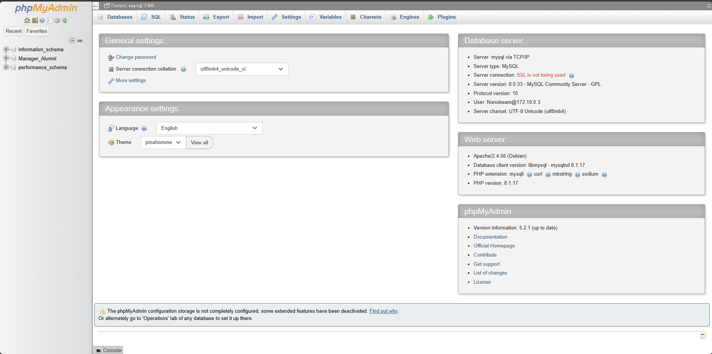

To launch our database, we can run an up command from our command line:<br/>
(With -d for enable detached mode)

```
$ docker-compose up -d
```
<br/>
<br/>



<br/>
<br/>
And down here is the link to Swagger-ui when you connect successful.<br/>
[Swagger-ui](http://localhost:8080/swagger-ui/index.html#/)